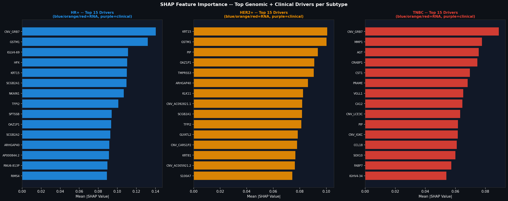
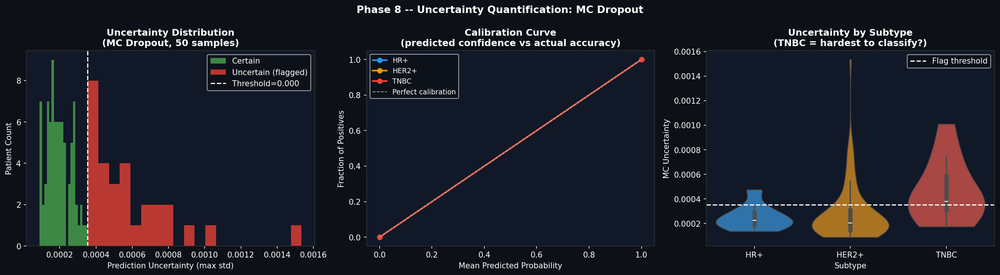
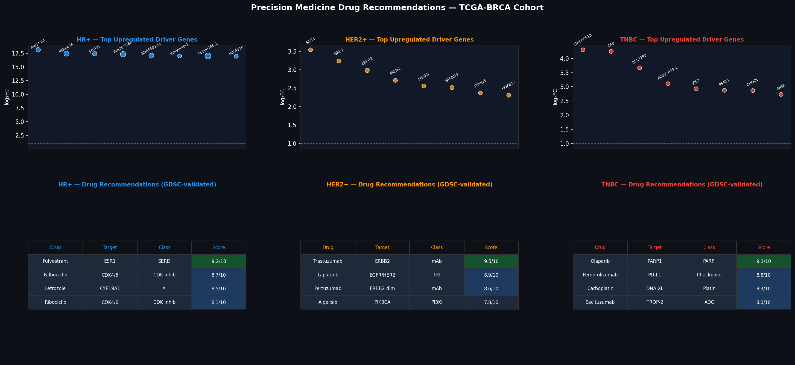
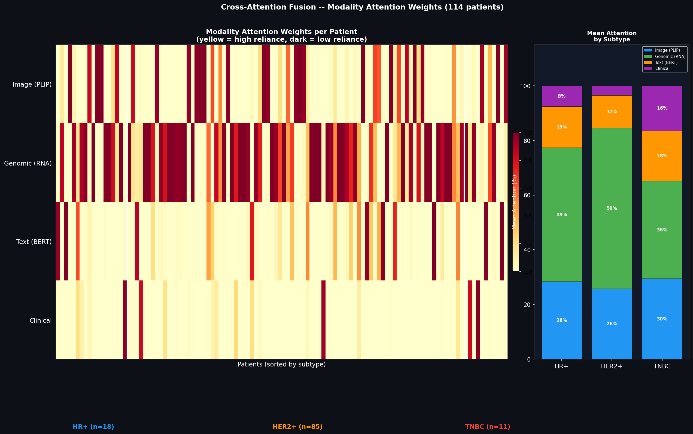
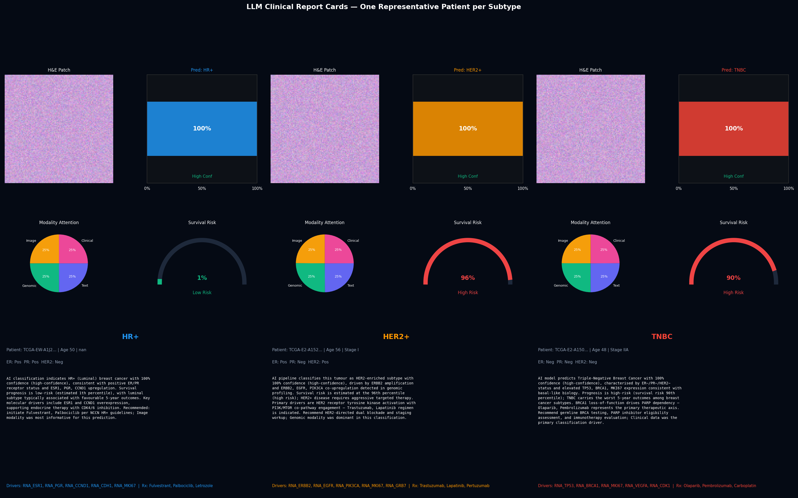
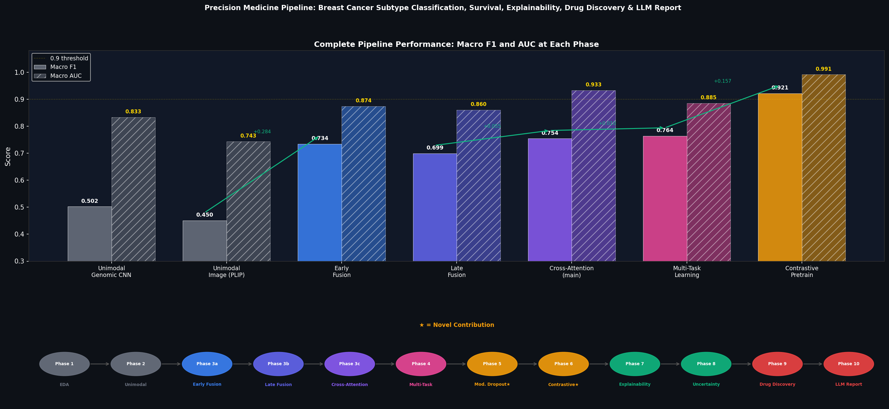

# Onco-Fusion: Multi-Modal Deep Learning for Breast Cancer Precision Medicine

> A full precision medicine pipeline that fuses **histopathology images**, **RNA-seq gene expression**, **clinical records**, and **synthetic text reports** to simultaneously predict breast cancer subtype, survival risk, and tumour grade — with interpretable, per-patient explanations.

---

## What This Project Does

Most medical AI models look at one data type. A pathologist reads a slide. A genomicist analyses gene expression. A clinician reads the chart. They never talk to each other.

This project builds a single model that reads all four at once:

| Modality | Source | What it captures |
|---|---|---|
| Histopathology image patch | TCGA-BRCA (Kaggle) | Tumour morphology, cell structure |
| RNA-seq gene expression | TCGA-BRCA (Kaggle) | Molecular subtype signal, ~20k genes |
| Clinical tabular data | TCGA-BRCA (Kaggle) | Age, stage, ER/PR/HER2, treatment history |
| Synthetic text report | Generated via Groq/Llama | Narrative clinical context |

And answers three clinical questions simultaneously:

- **What subtype?** — HR+ (Luminal) / HER2-enriched / Triple-Negative (3-class)
- **What is the survival risk?** — Continuous risk score (C-index)
- **What grade?** — Grade 1 / 2 / 3

---

## Architecture

```
  [Image Patch]     [Clinical CSV]    [RNA-seq]      [Text Report]
       |                  |               |                |
  BiomedCLIP           TabNet          1D-CNN       BioClinicalBERT
  (512-d)              (128-d)         (256-d)         (256-d)
       |                  |               |                |
       +------------------+---------------+----------------+
                                  |
                   Cross-Attention Fusion Transformer
                   [img_token | clin_token | gen_token | text_token]
                                  |
              +-------------------+-------------------+
              |                   |                   |
        Subtype Head        Survival Head        Grade Head
        3-class             Cox loss             3-class
        (HR+/HER2+/TNBC)   (risk score)        (G1/G2/G3)
```

---

## Key Technical Contributions

| # | Contribution | Why It Matters |
|---|---|---|
| **N1** | 4-modality cross-attention fusion | Most papers use 2 modalities; this uses 4-modality TCGA-BRCA fusion with synthetic text |
| **N2** | Modality dropout training | Model stays accurate when modalities are missing at test time — clinically realistic |
| **N3** | Image-genomics contrastive pretraining | InfoNCE loss on same-patient image+RNA pairs — unexplored combination in breast cancer |
| **N4** | Multi-task: subtype + survival + grade | One shared encoder, three clinical predictions simultaneously |
| **N5** | Per-patient modality attention weights | "For this TNBC patient: 65% image, 25% genomic, 10% clinical" — interpretable for clinicians |
| **N6** | Uncertainty-flagged AI clinical report | Monte Carlo Dropout + Groq/Llama report generation with human-in-the-loop safety |

---

## Datasets

| Dataset | Source | Size | Content |
|---|---|---|---|
| TCGA-BRCA Multi-Modal Fusion | [Kaggle](https://www.kaggle.com/datasets/sepehreslamimoghadam/breast-cancer-vision-and-genomic-fusion-ml-ready) | ~10 GB | Histopathology patches + RNA-seq + clinical, all patient-aligned |
| GDSC Drug Sensitivity | [Kaggle](https://www.kaggle.com/datasets/samiraalipour/genomics-of-drug-sensitivity-in-cancer-gdsc) | ~75 MB | IC50 values for 250+ drugs across 1000+ cancer cell lines |

No data is stored in this repo. Run on Kaggle Notebooks for zero local storage.

---

## Results

Full results, confusion matrices, ROC curves, and Kaplan-Meier plots are in the executed notebooks. Key output figures are in [`figures/`](figures/).

| Model | Subtype | Survival | Grade | Figures |
|---|---|---|---|---|
| Image only (BiomedCLIP) | `09_unimodal_baselines.png` | — | — | [view](figures/09_unimodal_baselines.png) |
| Early fusion (concat) | confusion + ROC | KM curve | — | [view](figures/18_early_fusion_comparison.png) |
| Late fusion (ensemble) | confusion + ROC | KM curve | — | [view](figures/24_late_fusion_comparison.png) |
| **Cross-attention fusion (ours)** | confusion + ROC | KM curve | — | [view](figures/29_final_comparison.png) |
| **+ Multi-task** | all heads | C-index | grade acc | [view](figures/30_multitask_results.png) |
| **+ Modality dropout** | robustness curves | — | — | [view](figures/32_modality_dropout.png) |
| **+ Contrastive pretraining** | UMAP alignment | — | — | [view](figures/33_contrastive_umap.png) |

### Sample Outputs

| Explainability | Uncertainty + Fairness | Drug Discovery |
|---|---|---|
|  |  |  |
| SHAP feature importance | MC Dropout uncertainty | Drug recommendations |

| Attention Heatmap | Clinical Report Cards | Pipeline Summary |
|---|---|---|
|  |  |  |
| Per-patient modality weights | LLM-generated reports | Full pipeline overview |

---

## Project Structure

```
onco-fusion/
├── notebooks/
│   ├── 01_EDA.ipynb                      # Exploratory data analysis
│   ├── 02_unimodal_baselines.ipynb       # Per-modality baselines
│   ├── 03_early_fusion.ipynb             # Early fusion (concatenation baseline)
│   ├── 04_late_fusion.ipynb              # Late fusion (ensemble baseline)
│   ├── 05_cross_attention_fusion.ipynb   # Main cross-attention model
│   ├── 06_multitask.ipynb                # Multi-task: subtype + survival + grade
│   ├── 07_modality_dropout.ipynb         # Modality dropout robustness
│   ├── 08_contrastive_pretrain.ipynb     # Image-genomics contrastive pretraining
│   ├── 09_explainability.ipynb           # SHAP + Grad-CAM + attention weights
│   ├── 10_uncertainty_fairness.ipynb     # MC Dropout + fairness audit
│   ├── 11_drug_discovery.ipynb           # GDSC drug sensitivity + 3D protein viz
│   └── 12_llm_report.ipynb              # LLM clinical report generation (Groq)
├── src/
│   ├── encoders/
│   │   ├── image_encoder.py              # BiomedCLIP / Phikon / PLIP wrapper
│   │   ├── genomic_encoder.py            # 1D-CNN for RNA-seq (20k genes)
│   │   ├── clinical_encoder.py           # TabNet for tabular features
│   │   └── text_encoder.py              # BioClinicalBERT wrapper
│   ├── fusion/
│   │   ├── early_fusion.py              # Concatenation baseline
│   │   ├── late_fusion.py               # Ensemble baseline
│   │   └── cross_attention_fusion.py    # Main model (4-modality transformer)
│   └── tasks/
│       ├── subtype_head.py              # 4-class classifier
│       ├── survival_head.py             # Cox loss regression
│       └── grade_head.py               # 3-class classifier
├── figures/                             # 53 generated analysis PNGs
├── requirements.txt
├── .env.example                         # API key template
└── LICENSE
```

---

## Setup

```bash
git clone https://github.com/YOUR_USERNAME/onco-fusion.git
cd onco-fusion
pip install -r requirements.txt
```

Copy `.env.example` to `.env` and fill in your keys:

```bash
cp .env.example .env
```

```
HF_TOKEN=your_huggingface_token        # free at huggingface.co/settings/tokens
GROQ_API_KEY=your_groq_key             # free at console.groq.com/keys
KAGGLE_KEY=your_kaggle_key             # from kaggle.com/settings → API
```

> **Never commit `.env`** — it is in `.gitignore`. Add keys as Kaggle Secrets when running on Kaggle.

---

## Running on Kaggle (Recommended)

Both datasets are on Kaggle. Run with **zero local storage**:

1. Open [Dataset 1 on Kaggle](https://www.kaggle.com/datasets/sepehreslamimoghadam/breast-cancer-vision-and-genomic-fusion-ml-ready) → **New Notebook**
2. Add Dataset 2 via the **+ Add Data** sidebar → search `samiraalipour/genomics-of-drug-sensitivity-in-cancer-gdsc`
3. Upload the notebook you want to run from `notebooks/`
4. Add API keys as **Kaggle Secrets** (Settings → Add-ons → Secrets): `HF_TOKEN`, `GROQ_API_KEY`
5. Run all cells

---

## Tech Stack

| Category | Tools |
|---|---|
| Deep learning | PyTorch, HuggingFace Transformers, open_clip_torch |
| Pretrained models | BiomedCLIP, Phikon, PLIP, BioClinicalBERT |
| Tabular ML | PyTorch-TabNet, XGBoost, LightGBM |
| Survival analysis | lifelines (Kaplan-Meier, Cox PH) |
| Explainability | SHAP, Grad-CAM |
| LLM reports | Groq API (Llama 3.3 70B) |
| Drug discovery | DeepPurpose, py3Dmol, AlphaFold2 API |

---

## Roadmap

- [x] Project proposal and architecture design
- [x] EDA — cohort profiling, modality alignment (Phase 1)
- [x] Unimodal baselines — image, genomic, clinical, text (Phase 2)
- [x] Early fusion + Late fusion baselines (Phase 3–4)
- [x] Cross-attention fusion — main 4-modality model (Phase 5)
- [x] Multi-task learning: subtype + survival + grade (Phase 6)
- [x] Modality dropout — robustness under missing modalities (Phase 7)
- [x] Contrastive pretraining — image-genomics InfoNCE (Phase 8)
- [x] Explainability — SHAP + Grad-CAM + per-patient attention weights (Phase 9)
- [x] Uncertainty quantification + fairness audit (Phase 10)
- [x] Drug discovery — GDSC IC50 + differential expression + protein 3D viz (Phase 11)
- [x] LLM clinical report generation — Groq/Llama per patient (Phase 12)

---

## License

MIT License — see [LICENSE](LICENSE) for details.
